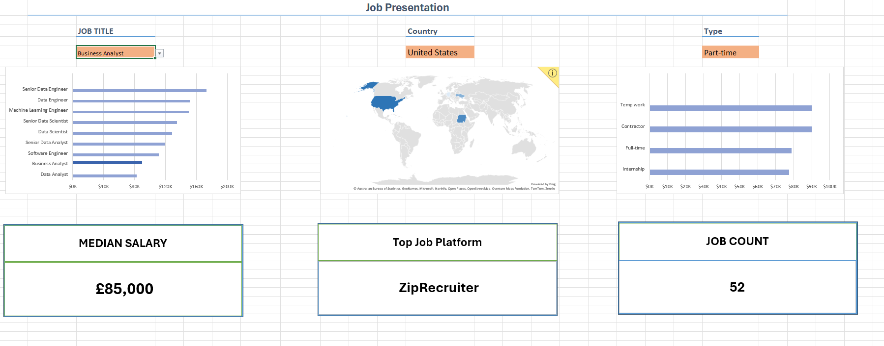

***ENGLISH***

***Data jobs and their salaries on one interactive Excel Dashboard***
-
This project was created following Luke Barousse's YouTube tutorial on Excel for Beginners.
Link to the tutorial: *https://www.youtube.com/watch?v=pCJ15nGFgVg&t=37642s* 

I have approached this tutorial with one goal in mind: to effectively learn Excel by working and interacting with the data in the real world scenario in order to effectively prepare myself for the Data Analyst job.

In this interactive dashboard one can check the salaries for particular Data Science job as well as the sites that have the most offers for a particular job in this field and the count of said offers on a particular site.

---

The offers can be sorted by:
- Country
- Job
- Working Hours

Each category affects the values and the graphs representing the data. 

Skills used:
- Excel
- Formulas & functions
- Data Validation
- Pivot Tables
  
---
A few examples:

*Looking for a Full-time Data Analyst job in Poland*

*Looking for a Part-time Business Analyst job in United States*

***POLISH***

***Dane dotyczące pracy i wynagrodzeń w pracach związanych z Data na interaktywnej tablicy stworzonej w programie Excel***
-
Projekt ten został stworzony na bazie poradnika dla początkujących w programie Excel autorstwa Luke Barrousse'a.
Odnośnik do poradnika: *https://www.youtube.com/watch?v=pCJ15nGFgVg&t=37642s* 

Podszedłem do tego samouczka mając w głowie jeden cel - skuteczną naukę programu Excel poprzez działanie na bazach danych starając odtworzyć warunki panujące w prawdziwej pracy. 

W tej interaktywnej tablicy każdy może sprawdzić płace dla konkretnej pracy związanej z Data Science. Poza wynagrodzeniem, pokazane są także najpopularniejsze strony z ofertami jak i liczba ofert zawartych na danej stronie.

---

Oferty pracy mogą być filtrowane przez następujące warunki: 
- Państwo
- Praca
- Etat

Każdy z tych warunków wpływa na tą interaktywną tablicę w czasie rzeczywistym ukazując dokładne dane w postaci wykresów.  

Umiejętności wykorzystane w tym projekcie:
- Excel
- Formuły i funkcje 
- Walidacja danych
- Tabele przestawne
  
---
A o to kilka przykładów:

*Poszukiwanie pracy jako Analityk Danych na pełen etat w Polsce*

*Poszukiwanie pracy jako Analityk Biznesowy na pół etatu w Stanach Zjednoczonych Ameryki*

