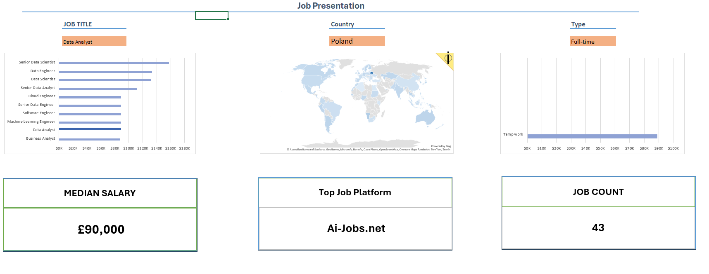

***Data jobs and their salaries on one interactive Excel Dashboard***
-
This project was created following Luke Barousse's YouTube tutorial on Excel for Beginners.
Link to the tutorial: *https://www.youtube.com/watch?v=pCJ15nGFgVg&t=37642s* 

I have approached this tutorial with one goal in mind: to effectively learn Excel by working and interacting with the data in the real world scenario in order to effectively prepare myself for the Data Analyst job.

In this interactive dashboard one can check the salaries for particular Data Science job as well as the sites that have the most offers for a particular job in this field and the count of said offers on a particular site.

---

The offers can be sorted by:
- Country
- Job
- Working Hours

Each category affects the values and the graphs representing the data. 

Skills used:
- Excel
- Formulas
- Data Validation

---

